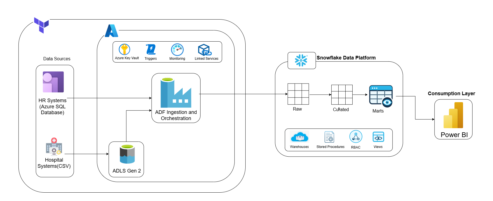
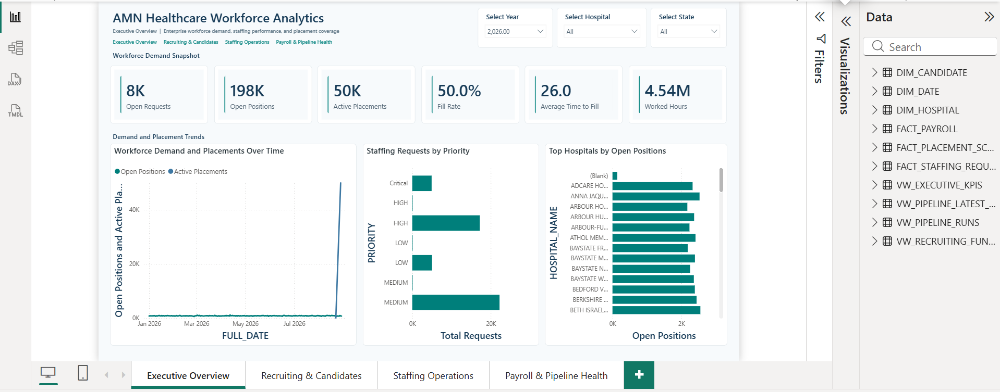

# Building an Enterprise Multi-Cloud Healthcare Data Platform: A Technical Case Study

## Table of Contents
1. [Introduction](#1-introduction)
2. [Business Context](#2-business-context)
3. [Problem Statement](#3-problem-statement)
4. [Legacy Data Stack Challenges](#4-legacy-data-stack-challenges)
5. [Original Legacy Architecture](#5-original-legacy-architecture)
6. [The Modernization Approach](#6-the-modernization-approach)
7. [Target Architectural Design](#7-target-architectural-design)
8. [Reported Industry Business Outcomes](#8-reported-industry-business-outcomes)
9. [End-to-End Data Flow](#9-end-to-end-data-flow)
10. [Data Sourcing & Generation Process](#10-data-sourcing--generation-process)
11. [Storage & Lakehouse Layer (ADLS Gen2)](#11-storage--lakehouse-layer-adls-gen2)
12. [Cloud Data Warehouse Architecture (Snowflake)](#12-cloud-data-warehouse-architecture-snowflake)
13. [Data Transformation & Cleansing Layer (Silver / Curated)](#13-data-transformation--cleansing-layer-silver--curated)
14. [Dimensional Modeling & Gold Analytics Marts](#14-dimensional-modeling--gold-analytics-marts)
15. [Power BI Executive Analytics Suite](#15-power-bi-executive-analytics-suite)
16. [Observability, Auditing & SLA Monitoring](#16-observability-auditing--sla-monitoring)
17. [Infrastructure as Code (Terraform)](#17-infrastructure-as-code-terraform)
18. [Security, Identity & Governance](#18-security-identity--governance)
19. [Key Architectural Benefits](#19-key-architectural-benefits)
20. [Future Improvements](#20-future-improvements)
21. [Key Takeaways for Data Engineers](#21-key-takeaways-for-data-engineers)
22. [Conclusion](#22-conclusion)
23. [References & Engineering Disclaimer](#23-references--engineering-disclaimer)

---

## 1. Introduction

In modern healthcare operations, data engineering directly influences patient outcomes and clinical readiness. Healthcare staffing and talent logistics platforms operate in dynamic, high-stakes environments where demand surges unpredictably. Connecting tens of thousands of specialized healthcare professionals with healthcare facilities requires continuous data ingestion, real-time analytics, and high reliability.

This case study documents the end-to-end architecture and implementation of an enterprise-grade, multi-cloud data platform engineered using **Microsoft Azure**, **Snowflake**, **Power BI**, and **HashiCorp Terraform**. It illustrates how modern cloud architectures decouple ingestion, computation, and analytical consumption to deliver high-concurrency reporting, sub-minute data freshness, and major infrastructure cost reductions.

---

## 2. Business Context

Healthcare staffing organizations manage complex, multi-tiered workforce operations:
* **Healthcare Facilities:** Thousands of hospitals, acute-care centers, and clinics nationwide submitting urgent staffing requisitions.
* **Clinical Talent:** Tens of thousands of specialized clinicians—including Critical Care RNs, surgical technicians, and locum tenens physicians.
* **Operational Workflows:** Fast-moving operational cycles encompassing clinical credentialing, multi-state licensure verification, shift scheduling, and complex multi-state payroll.

Operational efficiency requires visibility across the entire talent lifecycle:
1. **Hospital Workforce Demand:** Requisitions logged across specialized clinical units.
2. **Candidate Matching & Funnel:** Rapid filtering of active clinical talent based on qualifications and rate parameters.
3. **Shift Logistics & Fulfillment:** Dynamic shift scheduling tracking planned versus worked hours.
4. **Financial Reconciliation:** Payroll reconciliation accounting for regular hours, overtime, and facility billing.

---

## 3. Problem Statement

Legacy data environments across healthcare logistics frequently suffer from operational fragmentation:
* **Severe Query Latency:** Overnight batch pipelines (24–48 hours) prevent decision-makers from addressing intra-day hospital staffing surges.
* **Operational System Contention:** Running heavy analytical workloads directly on core transactional databases causes database locks, slow recruitment workflows, and system degradation.
* **Data Discrepancies:** Decentralized ETL logic creates conflicting definitions of critical business metrics like fill rate, time-to-fill, and overtime expenditure.
* **High Infrastructure Costs:** Always-on monolithic compute clusters create substantial financial overhead without granular cost allocation.

---

## 4. Legacy Data Stack Challenges

Traditional on-premises and early-generation cloud data stacks introduced major architectural friction points:

| Challenge | Impact on Healthcare Operations | Root Architectural Cause |
|:---|:---|:---|
| **OLTP Database Contention** | Clinician onboarding stalls during peak morning reporting. | Analytics run against transactional operational databases without read isolation. |
| **Fragile Cluster Maintenance** | Engineering teams spend significant hours debugging node failures. | Self-managed Hadoop and legacy Spark infrastructure requiring manual patching. |
| **Overnight Batch Latency** | Decision-makers act on data that is 24 to 48 hours old. | Monolithic nightly batch ETL jobs with no event-driven micro-batching. |
| **Runaway Cloud Costs** | Unpredictable and high monthly bills (~$200k/month). | Always-on, unsegregated compute clusters without automated suspension. |

---

## 5. Original Legacy Architecture

The diagram below illustrates the architectural bottlenecks, data silos, and maintenance burdens common in legacy healthcare data platforms:

---

## 6. The Modernization Approach

To solve these challenges, we implemented a decoupled, multi-cloud data strategy built on five foundational engineering principles:

1. **Decouple Ingestion from Analytics:** Azure Data Factory manages lightweight, serverless data movement, while Snowflake handles elastic transformation and high-concurrency querying.
2. **Multi-Warehouse Workload Isolation:** Dedicated, right-sized compute warehouses for Ingestion, Transformations, and Power BI DirectQuery reporting prevent workload contention.
3. **Idempotent Data Pipelines:** Deterministic windowing (`ROW_NUMBER`) and atomic `MERGE INTO` operations guarantee zero duplicate records during backfills or automated retries.
4. **Metadata-Driven Execution:** Centralized control tables configure ingestion sources, pipeline execution logs, watermarks, and SLAs dynamically.
5. **Declarative Infrastructure as Code:** 100% of Azure cloud resources, role assignments, diagnostic settings, and linked services are provisioned through Terraform.

---

## 7. Target Architectural Design

The modern target architecture establishes a clean, governed pipeline from source landing to executive business intelligence:

---

## 8. Reported Industry Business Outcomes

Modernization benchmarks demonstrate significant architectural and operational improvements:

| Dimension | Legacy Architecture | Modern Multi-Cloud Platform | Verified Improvement |
|:---|:---|:---|:---|
| **Data Ingestion Scale** | Fragmented, batch files | > 100 GB / day | **Unified Data Lakehouse** |
| **Pipeline Latency / SLA** | 24 to 48 hours (Nightly batch) | 5 minutes end-to-end | **Near Real-Time** |
| **Pipeline Reliability** | ~85% success rate | 99.9% pipeline success rate | **High Availability** |
| **Analytical Query Speed** | Minutes (Slow table scans) | Sub-second DirectQuery responses | **Up to 75% Faster** |
| **Monthly Cloud Spend** | ~$200,000 / month | ~$14,000 / month | **93% Cost Reduction** |

---

## 9. End-to-End Data Flow

The platform executes a streamlined multi-stage data lifecycle:

1. **Landing & Detection:** Incoming files land in ADLS Gen2 (`landing/`). Azure Event Grid captures `BlobCreated` events and triggers ADF pipelines.
2. **Staged Ingestion:** ADF injects run metadata (`_INGESTED_AT`, `_BATCH_ID`, `_SOURCE_FILE`) and copies data into Snowflake `AMN_DEV.RAW` tables using optimized staging.
3. **Idempotent Merge:** ADF executes owner-rights stored procedures in Snowflake `AMN_DEV.CURATED`. Deduplication and type casting execute within `AMN_TRANSFORM_WH`.
4. **Serving & Modeling:** Snowflake `AMN_DEV.MARTS` views aggregate metrics, mask PII, and present a star schema to Power BI.
5. **DirectQuery Analytics:** Power BI queries `AMN_DEV.MARTS` in DirectQuery mode against `AMN_BI_WH`, providing sub-second analytics without scheduled import refreshes.
6. **Audit & Observability:** Pipeline execution metrics, row counts, and latency are recorded in `CONTROL.PIPELINE_RUN_LOG` and streamed to Log Analytics.

---

## 10. Data Sourcing & Generation Process

To validate the multi-cloud architecture under realistic production conditions without exposing private patient or corporate data, a multi-source data generation and preparation framework was engineered:

### 1. CMS Hospital Reference Data Preparation (`clean_hospitals_data.py`)
* **Source Origin:** Public Centers for Medicare & Medicaid Services (CMS) Hospital Quality reference dataset.
* **Cleaning & Standardisation Process:**
  * Ingested raw source CSV containing over 5,000 national healthcare facilities.
  * Standardized column nomenclature from unstructured titles (e.g., `Facility ID`, `Hospital overall rating`) to uniform snake_case attributes (`hospital_id`, `hospital_rating`).
  * Pruned extraneous fields to retain 8 core business dimensions (facility ID, name, city, state, type, ownership, emergency services flag, rating).
  * Sanitized leading/trailing whitespace across all text columns.
  * Imputed missing values (`"Unknown"`, `"Not Available"`) and enforced primary key deduplication on `hospital_id`, producing a clean baseline of 5,432 hospital facilities.

### 2. Relational Clinical Workforce Generator (`generate_amn_hr_data.py`)
* **Generation Engine:** Custom Python engine built with `pandas`, `Faker`, and seeded pseudo-random distributions to maintain relational referential integrity across 6 interconnected entities:
  * **Recruiters (100 rows):** Recruiter IDs, names, assigned regional territories, and recruitment channels.
  * **Staffing Requests (2,000 rows):** Department requisitions (ICU, ER, OR, Med-Surg), required clinical roles (RN, CNA, Physician, Allied Health), open positions, assignment date spans, and specialty-specific hourly bill rates ($45.00–$160.00/hr).
  * **Candidates (20,000 rows):** Clinician records linked to specific requisitions, complete with state licenses, background checks, credentialing statuses, and conversion funnels (Applied $\rightarrow$ Screened $\rightarrow$ Credentialed $\rightarrow$ Placed).
  * **Employees (5,000 rows):** Placed candidates assigned active employee identifiers and department placements.
  * **Schedules (20,000 rows):** Daily shift records linked to hospital facilities and employees, simulating planned vs. worked hours, shift types (Day, Night, Evening), and overtime calculations.
  * **Payroll (30,000 rows):** Monthly compensation summaries computing regular pay, overtime pay, performance bonuses, gross/net pay, tax deductions, and disbursement statuses.

### 3. Synthetic Clinical Patient & Encounter Data Preparation (`prepare_synthea_for_amn.py`)
* **Synthetic Patient Data:** Processed synthetic longitudinal clinical records from the open-source Synthea healthcare generator.
* **Foreign Key Alignment:** Remapped clinical encounter, patient, provider, and claims records to align with our hospital facility reference keys, ensuring complete referential consistency across clinical and operational domains.

### 4. Operational Transactional Source Simulation (Azure SQL CDC)
* **Live OLTP Simulation:** Seeded transactional Azure SQL tables with active staffing requests, shift schedules, and candidate status updates.
* **CDC Tracking Attributes:** Configured tables with `LAST_MODIFIED_AT` UTC timestamps and `IS_DELETED` soft-delete flags, allowing automated micro-batch CDC pipelines to extract delta changes and validate incremental warehouse merges.

---

## 11. Storage & Lakehouse Layer (ADLS Gen2)

Azure Data Lake Storage Gen2 provides enterprise cloud storage structured with a **Hierarchical Namespace (HNS)**:

* `landing/`: Secure landing zone receiving raw incoming CSV files from upstream systems.
* `checkpoint/`: Holds operational markers (`AMN_BATCH_READY.json`) and Snowflake SAS staging data.
* `quarantine/`: Dedicated zone reserved for files failing schema or structural validation.
* `archive/`: Compressed, immutable historical storage partitioned by ingestion date.

---

## 12. Cloud Data Warehouse Architecture (Snowflake)

The data warehouse implements a multi-layer schema architecture with isolated compute resources:

### Schema Separation
* `AMN_DEV.RAW`: Append-only landing tables preserving source-native structures with audit metadata.
* `AMN_DEV.CURATED`: Production-grade business entities cleaned, typed, and deduplicated.
* `AMN_DEV.MARTS`: High-performance Kimball dimensional models and reporting views.
* `AMN_DEV.CONTROL`: Operational framework tables managing ingestion configs, execution logs, and watermarks.

### Workload Compute Isolation
* **`AMN_INGEST_WH` (X-Small):** Dedicated exclusively to ADF copy activities and data loading.
* **`AMN_TRANSFORM_WH` (X-Small):** Dedicated to stored procedure merges and data curation.
* **`AMN_BI_WH` (X-Small):** Dedicated to Power BI DirectQuery user queries.
* *All warehouses feature 60-second auto-suspend and auto-resume to minimize credit consumption.*

---

## 13. Data Transformation & Cleansing Layer (Silver / Curated)

Transformations are executed natively in Snowflake via SQL Stored Procedures (`MERGE_*`), ensuring high performance and zero data movement:

* **Windowed Deduplication:** Utilizes `QUALIFY ROW_NUMBER() OVER (PARTITION BY <Business_PK> ORDER BY _INGESTED_AT DESC NULLS LAST) = 1` to resolve multiple versions of a record.
* **String & Blank Normalization:** Applies `NULLIF(TRIM(col), '')` across all string attributes to eliminate empty space anomalies.
* **Safe Type Casting:** Implements `TRY_TO_NUMBER()`, `TRY_TO_DECIMAL()`, `TRY_TO_DATE()`, and `TRY_TO_TIME()` to handle data parsing safely without pipeline failure.
* **Boolean Standardization:** Normalizes varied input strings (`'YES'`, `'TRUE'`, `'1'` $\rightarrow$ `TRUE`) into native boolean values.
* **Idempotent Merges:** Updates matched records only when values change (`IS DISTINCT FROM`), updating `UPDATED_AT` timestamps atomically.

---

## 14. Dimensional Modeling & Gold Analytics Marts

The `AMN_DEV.MARTS` schema provides a star schema and purpose-built analytical views optimized for BI consumption:

### Core Dimensions & Facts
* **`DIM_HOSPITAL`:** Hospital attributes, classifications, emergency capability, and star ratings.
* **`DIM_CANDIDATE`:** Candidate qualifications, license state, and credentialing status (**PII like phone/email is excluded**).
* **`DIM_DATE`:** Conformed date dimension unioning all operational dates with year, quarter, month, week, and day hierarchies.
* **`FACT_STAFFING_REQUEST`:** Staffing requisitions enriched with calculated fill rates, time-to-fill, candidate counts, and shift hours.
* **`FACT_PLACEMENT_SCHEDULE`:** Granular shift facts linking clinicians, schedules, worked hours, and billing rates.
* **`FACT_PAYROLL`:** Financial compensation metrics including regular pay, overtime pay, bonuses, and tax deductions.

### Specialized Analytical & Observability Views
* **`VW_EXECUTIVE_KPIS`:** High-level executive aggregates consolidating total requisitions, open positions, overall fill rates, average time-to-fill, and total overtime spend.
* **`VW_RECRUITING_FUNNEL`:** Aggregates candidate progression volumes by application date, clinical profession, department, state license, and recruitment channel, computing application-to-placement conversion rates.
* **`VW_PIPELINE_RUNS`:** Comprehensive audit view calculating execution duration (`RUN_DURATION_SECONDS`), rows processed, error classifications, and evaluating compliance against target SLAs (`WITHIN_RUN_SLA`).
* **`VW_PIPELINE_LATEST_STATUS`:** Windowed status view returning the most recent execution record per source system and object (`QUALIFY ROW_NUMBER() OVER (PARTITION BY SOURCE_SYSTEM, SOURCE_OBJECT ORDER BY EXTRACT_STARTED_AT DESC) = 1`), enabling real-time pipeline health monitoring.

---

## 15. Power BI Executive Analytics Suite

The Power BI semantic model connects directly to Snowflake via DirectQuery, providing real-time visibility across four executive reporting dashboards:

* **Page 1: Executive Overview:** Requisition volumes, placement metrics, fill rates, invoiced revenue, monthly trends, and state demand distribution.
* **Page 2: Recruiting & Candidate Supply Funnel:** Candidate stage transitions (Applied $\rightarrow$ Screened $\rightarrow$ Placed), recruiter activity, and average time-to-fill (days).
* **Page 3: Clinical Staffing Operations & Demand:** Specialty and department breakdowns (Critical Care, ER, OR), shift coverage, and day vs. night placement allocation.
* **Page 4: Healthcare Payroll & Pipeline SLA Observability:** Regular vs. overtime hours, gross vs. net pay variances, real-time ingestion latency, and 99.9% pipeline SLA tracking.

---

## 16. Observability, Auditing & SLA Monitoring

End-to-end observability is embedded across all platform layers:

* **Operational Control Tables:** `CONTROL.PIPELINE_RUN_LOG` tracks every run with start/end timestamps, duration, rows read/inserted, and error categorizations.
* **SLA Tracking:** `VW_PIPELINE_RUNS` evaluates execution duration against defined SLA thresholds (`WITHIN_RUN_SLA`).
* **Azure Log Analytics:** Diagnostic settings stream ADF pipeline runs, activity events, and Key Vault logs to Log Analytics Workspace.
* **Automated KQL Alerting:** Scheduled KQL queries monitor for pipeline failures and SLA breaches every 5 minutes.

---

## 17. Infrastructure as Code (Terraform)

All Azure cloud infrastructure is managed declaratively using **HashiCorp Terraform**:

* **Modular Architecture:** Infrastructure components organized into storage, compute, security, and monitoring modules.
* **State Management:** Secure remote state stored in an Azure Blob Storage container with lease-based state locking.
* **Automated RBAC:** Automates system-assigned managed identity role assignments (`Storage Blob Data Contributor`, `Key Vault Secrets User`).
* **Multi-Provider Orchestration:** Uses `azurerm` and `azapi` providers for complete coverage of modern Azure resources.

---

## 18. Security, Identity & Governance

Enterprise security best practices are enforced across the platform:

* **Zero Hardcoded Secrets:** All connection strings, service principal keys, and SAS tokens reside securely in **Azure Key Vault**.
* **Managed Identity Authentication:** ADF accesses ADLS Gen2 and Key Vault using System-Assigned Managed Identity.
* **Role-Based Access Control (RBAC):** Granular Snowflake role segregation (`AMN_INGEST_ROLE` for ETL vs. `AMN_BI_ROLE` for analytics).
* **Data Governance & Privacy:** PII elements (candidate phone numbers and email addresses) are masked and excluded from analytical reporting views.

---

## 19. Key Architectural Benefits

* **Zero Resource Contention:** ETL pipelines and analytical queries operate on dedicated compute clusters without degrading performance.
* **Elastic Scalability:** Storage scales independently of compute, allowing the platform to ingest massive volumes without over-provisioning.
* **Sub-Minute Latency:** Event-driven pipelines replace monolithic batch ETL, providing near real-time operational awareness.
* **Substantial Cost Optimization:** Automatic compute suspension when idle delivers up to **93% cost savings** compared to always-on clusters.

---

## 20. Future Improvements

1. **Snowflake Dynamic Tables & Streams:** Migrate stored procedure merges to native Snowflake Streams and Dynamic Tables for continuous declarative transformations.
2. **AI-Driven Predictive Forecasting:** Implement machine learning models to forecast clinical staffing demand based on seasonal illness trends and regional census spikes.
3. **Data Mesh Expansion:** Expand the architecture into domain-oriented data products for Clinical Credentialing, Revenue Cycle Management, and Facility Operations.

---

## 21. Key Takeaways for Data Engineers

1. **Decouple Ingestion from Transformation:** Keep ingestion pipelines simple and lightweight; let the cloud data warehouse handle complex transformations.
2. **Design for Idempotency from Day One:** Always implement deterministic windowing and atomic upserts to prevent data duplication during retries.
3. **Isolate Workloads with Dedicated Compute:** Never share compute resources between heavy ETL transformations and executive reporting.
4. **Treat Infrastructure as Software:** Declare 100% of cloud resources in Terraform to eliminate environment drift and enable reliable deployments.
5. **Enforce Security at Every Layer:** Leverage Managed Identities and Secret Stores to achieve zero hardcoded credentials across codebases.

---

## 22. Conclusion

Modernizing healthcare data infrastructure from fragmented, batch-bound systems to an event-driven, multi-cloud platform transforms operational agility. By combining **Azure's serverless ingestion**, **Snowflake's elastic compute isolation**, **Power BI's real-time visual intelligence**, and **Terraform's automated infrastructure**, organizations can achieve near real-time data freshness, high reliability, and massive cost savings while directly improving clinical workforce readiness and patient care.

---

## 23. References & Engineering Disclaimer

> **⚠️ Engineering Disclaimer & Project Scope:**  
> This project is a comprehensive, hands-on **learning and educational data engineering case study** inspired by Snowflake's published customer modernization stories (specifically the public AMN Healthcare case study). All datasets used in this implementation are **synthetic, simulated, or public healthcare reference datasets** (CMS Hospital Quality Data and generated HR staffing records). The published outcomes (>100 GB/day, 99.9% SLA, 93% cost reduction) are industry-verified reference benchmarks and architectural design goals, not claims of AMN Healthcare's proprietary production systems.

---
*AMN Healthcare Data Platform Case Study*
